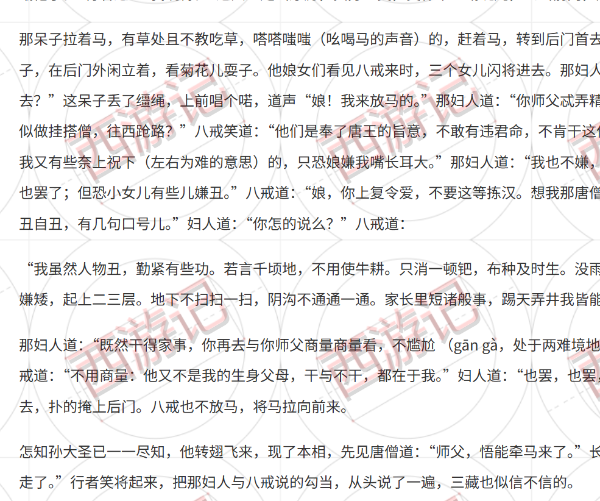

# @2080code/watermark


## 介绍
基于 CSS 的 `background` 给HTML元素添加 SVG 文字水印。

## 安装
```bash
npm install @2080code/watermark
```
```javascript
import WaterMark from '@2080code/watermark'
```
或
```html
<script src="watermark.js"></script>
```

## 使用
```javascript
// 创建实例
const Watermarker=new WaterMark({
    mode:'cover',
    // carrierElem:document.getElementById('article'),
    content:'西游记',
    fontFamily:'Microsoft YaHei',
    fontSize:'60px',
    fontColor:'black',
    opacity:0.15,
    rotateDegree:-30,
    margin:0,
    padding:40,
    // needClip:false,
    position:'center center',
    // repeat:'no-repeat',
    // tuning:true
})
// 绘制水印
Watermarker.draw({
    tuning:false,
    degraded:true,
})
```

## 参数说明
```javascript
new WaterMark(options)
```

参数|类型|默认值|说明
---|---|---|---
`options.name` | String | `'2080code-watermark'` | 水印的名称，会影响 cover 模式下水印层元素的 class 命名
`options.carrierElem` | HTMLElement | `document.body`| 水印层载体
`options.zIndex` | Number | `1000000` | 水印层（css z-index）
`options.mode` | String | `'mat'`（`'mat'\|'cover'`） | 水印放置模式，默认 `mat`，铺设在目标层底部；`cover` 模式会创建一个层，并覆盖在载体上。<br>*cover模式下为确保水印覆盖到，请检查载体宽高，mat 模式下水印的打印是非强制的，可能丢失*
`options.content` | String | `''` | 水印文字内容。
`options.fontFamily` | String | `'hei'` | 字体名
`options.fontWeight` | String | `'normal'` | 字体粗细
`options.fontSize` | String | `'16px'` | 字体大小
`options.fontColor` | String | `'black'` | 字体颜色
`options.baseline` | String | `'before-edge'` | 文本基线设置（svg text alignment-baseline）
`options.rotateDegree` | Number | `0` | 旋转角度
`options.size` | String | `'auto'` | 水印尺寸（css background-size）
`options.margin` | Number | `0` | 水印之间的外间距
`options.padding` | Number | `0` | 水印之间的内间距
`options.needClip` | Boolean | `true` | 是否裁切掉空白（margin、padding之外的空白）
`options.position` | String | `'center center'` | 水印铺设位置（css background-position）
`options.repeat` | String | `'repeat'` | 水印铺设方式（css background-repeat）
`options.opacity` | Number | `0.1` | 透明度，同时影响水印及调试层
`options.tuning` | Boolean | `false` | 调试模式开关，设为 `true` 会在水印下添加 canvas 画布生成的参照底图，能够观察到 `margin`、`padding`、`rotateDegree`、`baseline` 等参数的设置效果，方便调试。*目前只支持在 cover 模式下开启*
`options.degraded` | Boolean | `false` | 降级处理，更好的兼容性，默认 `false`。<br>（*canvas 的 `measureText` 本身具有对文字更精确的捕获，但因为兼容性问题，低版本浏览器对它的特性支持不完全，只得以 HTML DOM 的 `getComputedStyle` 取代 canvas `measureText` 来完成基础绘制和尺寸的捕获。*）


## 效果
### 生产效果

### 调试效果

